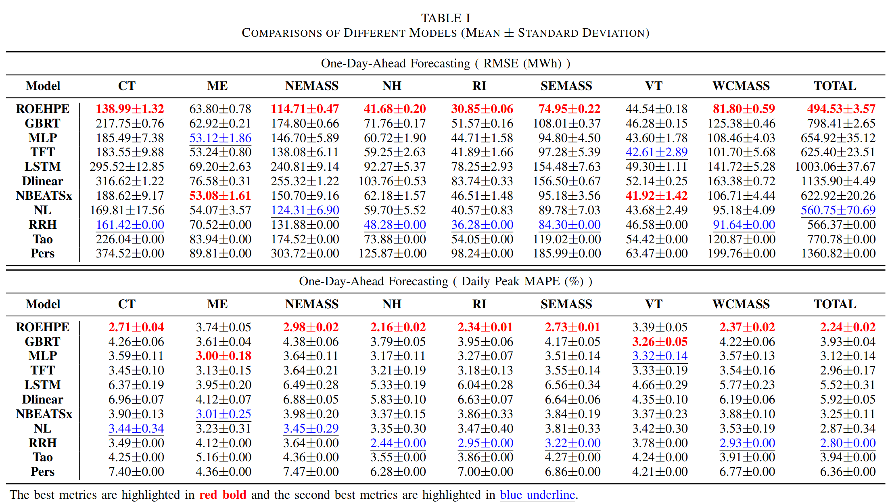
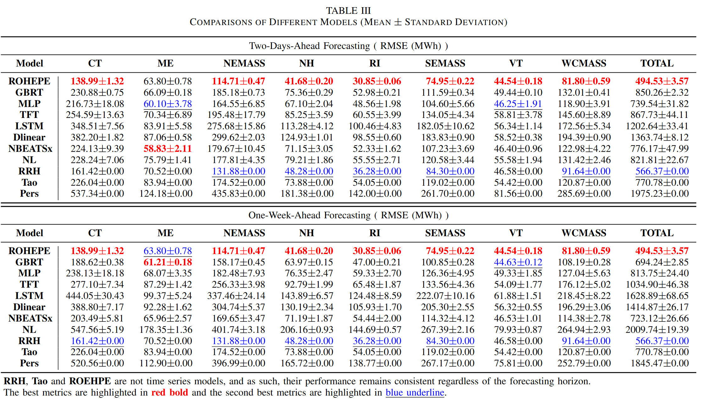

# Rank-One Embedded High-order Polynomial Ensemble (ROEHPE)
> This work proposed an novel ** Rank-One Embedded High-order Polynomial Ensemble (ROEHPE) ** model for load forecasting . ROEHPE not only have a greater representational capacity, but also circumvents the Curse of Dimensionality typically faced by multivariate high-order polynomial models.

Codes for the paper "[Make Polynomials Great Again: A Rank-OneEmbedded Polynomial Model for load Forecasting]". 

Authors: Pengyang Song, Qi Song, Han Feng, Hanfeng Zhou, Jue Wang


## Requirements

The must-have packages can be found in requirements.txt


## Experiments
### Data
All the data for experiments are saved in ```datasets/```. 
We concatenated the ISONE data collected and organized from GEFCom2017 ```gefcom2017.csv``` with the data provided by ISONE after 2017 ```ISONE2017-2024.csv```.

In ```experiments/graph.ipynb```, we presented the relevant illustrations.

### Reproduction
To reproduce the experiments for the benchmarks in the paper, please run
```
cd experiments/
bash run_experiments_dayahead.sh
```

```run_experiments_dayahead.sh```, ```experiments_twodayahead.sh```, ```run_experiments_weekahead.sh``` correspond to the 1-day-ahead, 2-day-ahead and 1-week-ahead forecasts, respectively.

```Tao and RRH.ipynb``` and ```ROEHPE.ipynb``` are the codes for RRH Tao and ROEHPE, respectively.

Note: There is NO multi-GPU/parallelling training in our codes. 

The results(models) and logs will be saved into new folders i.e. ```results/``` and ```logs/``` under ```experiments/```.

We provide the original results. To facilitate differentiation, we have updated the filenames of the original result files for different forecast horizons.
The results of all models, except RRH, Tao, and ROEHPE, are stored in the folders ```result_record_all/day```, ```result_record_all/2day```, and ```result_record_all/week```, which correspond to 1-day-ahead, 2-day-ahead, and 1-week-ahead forecasts, respectively.
ROEHPE, RRH and Tao do not require consideration of the forecast horizon, and are therefore stored separately.
```EnsembleGraph.pkl``` records the model stability of ROEHPE as the number of base learners in the ensemble varies.

The notebook ```plot.ipynb``` generates figures based on the original results stored in the ```result_record_all``` folder.

```load curve``` contains all the forecast curves for the nine zones.

### Example
An example of ROEHPE and benchmarks.





## Acknowledgments
Package ```benchmark/``` is modified based on the open code of [Hierarchical Neural Laplace](https://github.com/hkuedl/Multi-resolution-Energy-Forecasting). The rapid development of this work would not have been possible without this open-souce package. 
